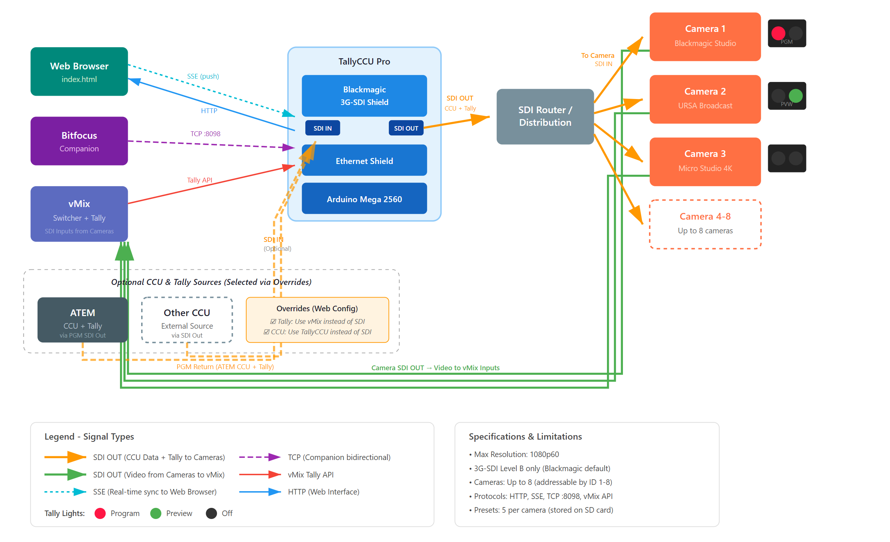
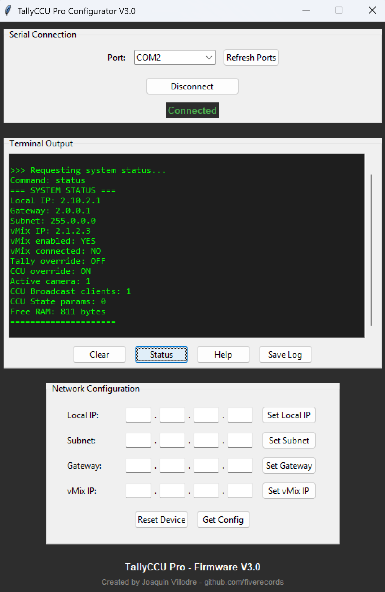
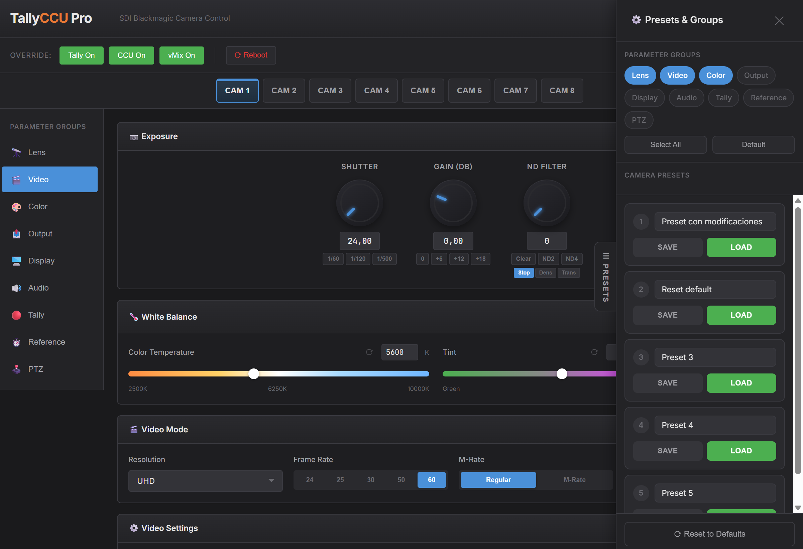
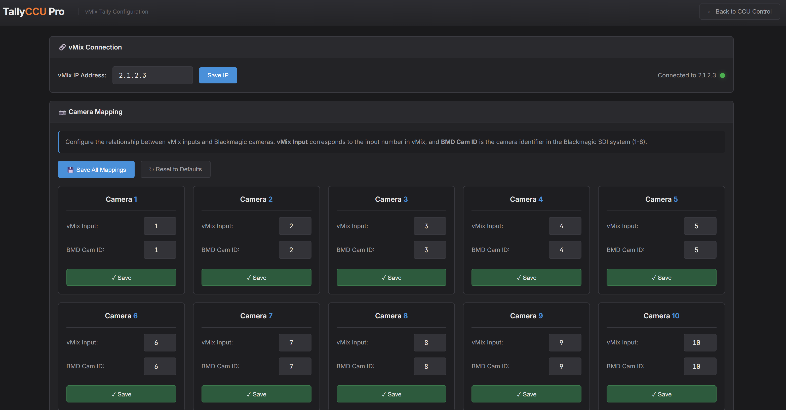
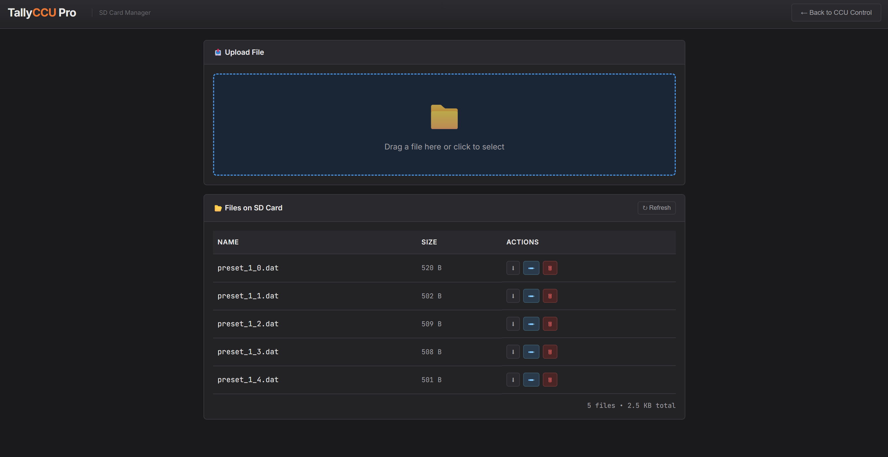

# TallyCCU Pro


<p align="center">
  <strong>Open-source CCU control system for Blackmagic Design cameras with vMix tally integration using the Blackmagic Arduino SDI Shield</strong>
</p>

TallyCCU Pro is an Arduino-based solution that provides full Camera Control Unit (CCU) functionality for Blackmagic cameras via SDI using the Blackmagic Arduino SDI Shield, along with real-time tally light integration with vMix. Control your cameras from a web browser, Bitfocus Companion, or build your own integration using the TCP API.

---

## Features

### Camera Control
- **Full CCU Parameters**: Iris, focus, zoom, white balance, ISO, shutter, ND filters
- **Color Correction**: Lift, gamma, gain, offset with visual color wheels
- **Display Settings**: Zebra, peaking, focus assist, LUT selection
- **Audio Control**: Mic levels, headphone mix, phantom power
- **PTZ Support**: Pan/tilt velocity and memory presets (for supported cameras)

### Tally System
- **vMix Integration**: Automatic tally lights from vMix program/preview state
- **Flexible Mapping**: Map any vMix input to any camera ID
- **Adjustable Brightness**: Independent front/rear tally brightness control

### Connectivity
- **Web Interface**: Full control from any browser on your network
- **Companion Module**: Stream Deck integration via Bitfocus Companion
- **TCP API**: Real-time bidirectional sync on port 8098
- **Serial Configuration**: Initial setup without network access

### Real-Time Synchronization (v3.5+)
- **Server-Sent Events (SSE)**: Instant parameter sync between web interface and Companion
- **Bidirectional Sync**: Changes in Companion appear instantly in the web interface and vice versa
- **Per-Camera State**: Browser maintains state for all 8 cameras, enabling seamless switching
- **Automatic State Recovery**: When either client connects, it receives current state from the other
- **Live Preset Updates**: Preset names sync instantly across all interfaces

### Preset System
- **Save/Load Presets**: Store complete camera configurations
- **Per-Camera Presets**: 5 presets per camera, stored on SD card
- **Group Selection**: Choose which parameter groups to include in presets




---

## Hardware Requirements

| Component | Model | Notes |
|-----------|-------|-------|
| Microcontroller | **Arduino Mega 2560** | Must be Mega (not Uno) due to memory requirements |
| Network | **Arduino Ethernet Shield 2** | W5500 chipset, includes SD card slot |
| SDI Interface | **Blackmagic 3G-SDI Shield** | For Arduino, directly from Blackmagic |
| Storage | **MicroSD Card** | 1-32GB, must be formatted correctly (see below) |
| Power | **9-12V DC Power Supply** | Required - USB power alone is insufficient |

### Shield Stacking Order

```
        +---------------------+
    3   |  Blackmagic SDI     |  <- Top
        +---------------------+
    2   |  Ethernet Shield    |  <- Middle  
        +---------------------+
    1   |  Arduino Mega 2560  |  <- Bottom
        +---------------------+
```


### CRITICAL: I2C Bridge Wires Required

The Blackmagic SDI Shield is designed for Arduino Uno, which has I2C pins at A4/A5. The Arduino Mega has I2C on different pins (20/21), so you MUST add two jumper wires on the **Blackmagic SDI Shield**:

```
Bridge connections on SDI Shield:
  - A4 --> SCL
  - A5 --> SDA
```

These bridges route the I2C signals to the correct pins. Without them, the SDI shield will not communicate with the Arduino Mega.

### CRITICAL: External Power Required

The system requires external power (9-12V DC) connected to the Blackmagic SDI Shield's power input. USB power alone does not provide enough current and the system will fail to boot properly.

---

## SD Card Setup

### Partition and Format Requirements

The SD card MUST meet these requirements:

1. **MBR Partition Table** (not GPT) - Windows and Mac sometimes create GPT partitions
2. **Single Partition** - Only one partition on the card
3. **Correct Filesystem**:
   - Cards 2GB or smaller: FAT16
   - Cards 4GB or larger: FAT32
   - **exFAT will NOT work**

### Recommended Formatting Procedure

**Do NOT use Windows Explorer or Mac Disk Utility** - they may create incompatible partition tables.

Use the official SD Card Formatter from the SD Association:
1. Download from: https://www.sdcard.org/downloads/formatter/
2. Select your SD card
3. Choose "Overwrite format" (not quick format)
4. Format the card

If you still have issues, use the SdFormatter sketch included in the SdFat library examples.

### Copy Web Interface Files

After formatting, copy these files to the SD card root:

```
SD Card Root/
+-- index.html      (Main CCU interface)
+-- tally.html      (Tally configuration)
+-- sdcard.html     (SD Card File manager)
```

---

## Installation

### Step 1: Hardware Assembly

1. Stack shields in order: Mega -> Ethernet -> SDI Shield
2. **Add I2C bridge wires**: A4 to pin 20, A5 to pin 21
3. Insert formatted SD card into Ethernet Shield slot
4. Connect 9-12V power supply to SDI Shield
5. Connect SDI output to your camera(s)

### Step 2: Arduino Firmware

**Required Libraries** (install via Arduino Library Manager):
- `SdFat` by Bill Greiman
- `Ethernet` (built-in)

**Blackmagic Library** (manual install):
1. Download from Blackmagic website (included with Desktop Video software)
2. Copy to Arduino libraries folder

**Upload Firmware**:
1. Open `Arduino/TallyCCUPro.ino` in Arduino IDE
2. Select Board: `Arduino Mega or Mega 2560`
3. Select Port: Your Arduino's COM port
4. Click Upload

### Step 3: Initial Network Configuration

Connect via serial monitor (115200 baud) or use the Serial Configurator tool:




```
Available commands:
  ip 192.168.1.100        Set Arduino IP address
  subnet 255.255.255.0    Set subnet mask  
  gateway 192.168.1.1     Set gateway
  vmixip 192.168.1.50     Set vMix computer IP
  status                  Show current configuration
  reset                   Restart Arduino
```

### Step 4: Verify Installation

1. Open browser: `http://YOUR_ARDUINO_IP/`
2. You should see the CCU Control interface
3. Select a camera and adjust parameters to test

---

## Web Interface

Access at `http://YOUR_ARDUINO_IP/`

> **Note**: Always use `http://` explicitly. Some modern browsers default to HTTPS, which is not supported. See [Limitations](#limitations).

### CCU Control (index.html)

The main control interface featuring:
- **Camera Selector**: Switch between cameras 1-8
- **Parameter Groups**: Lens, Video, Audio, Color Correction, Display, Tally, PTZ
- **Color Wheels**: Visual lift/gamma/gain/offset adjustment
- **Sliders**: Precise control with step buttons and reset
- **Presets**: Save and load 5 presets per camera
- **Real-Time Sync**: Changes from Companion appear instantly via SSE


### Tally Configuration (tally.html)

- **vMix IP**: Address of computer running vMix
- **Input Mapping**: Map vMix inputs to camera IDs
- **Connection Status**: Real-time indicator


### SD Card Manager (sdcard.html)

- **Upload**: Drag and drop files
- **Download**: Backup presets
- **Delete/Rename**: File management


---

## Bitfocus Companion Module

### Installation

1. Copy `companion-module/` to Companion's dev modules directory
2. Run `yarn install` inside the folder
3. In Companion Settings, set developer modules path
4. Add connection: "TallyCCU Pro"

### Actions Available

- All CCU parameters (set/increase/decrease/reset)
- Load/Save presets
- Change active camera
- vMix connection toggle

### Real-Time Sync

The Companion module automatically syncs with the web interface:
- Parameters changed in Companion are instantly reflected in the web UI
- Parameters changed in the web UI are instantly reflected in Companion variables
- When either client connects, it receives the current state from the other

---

## TCP Protocol (Port 8098)

For custom integrations, connect via TCP to port 8098.

### Commands (send to Arduino)

```
SUBSCRIBE                       Subscribe to real-time updates
UNSUBSCRIBE                     Unsubscribe from updates
PING                            Keep-alive (responds with PONG)
STATUS                          Get connection status
```

### Events (from Arduino to subscribed clients)

```
CCU <cameraId> <paramKey> <value>           Parameter changed
PRESET <cameraId> <presetId> <name>         Preset loaded
PRESETSAVED <cameraId> <presetId> <name>    Preset saved
REQUESTSYNC                                  Request client to send cached state
PONG                                         Ping response
SUBSCRIBED OK                                Subscription confirmed
```

### Sync Commands (for bidirectional sync)

```
CCUSYNC <cameraId> <paramKey> <value>       Send cached parameter to Arduino
                                            (forwarded to SSE clients)
```

---

## Architecture

### Synchronization Flow

```
┌─────────────┐         ┌─────────────┐         ┌─────────────┐
│   Web UI    │◄──SSE───│   Arduino   │◄──TCP───│  Companion  │
│  (Browser)  │───POST─►│  (Mega2560) │───TCP──►│   Module    │
└─────────────┘         └─────────────┘         └─────────────┘
      │                        │                       │
      │   cameraStates[]       │                       │   cameraStates{}
      │   (per-camera)         │                       │   (per-camera)
      └────────────────────────┴───────────────────────┘
                    Bidirectional Real-Time Sync
```

- **SSE (Server-Sent Events)**: Arduino pushes changes to web interface instantly
- **TCP Broadcast**: Arduino pushes changes to Companion module
- **POST /syncState**: Web sends cached state to Arduino for TCP broadcast
- **REQUESTSYNC**: Arduino requests state from connected clients on new connections

---

## Project Structure

```
TallyCCUPro/
├── firmware/              Arduino source code
│   ├── TallyCCUPro.ino   Main sketch
│   ├── CCUControl.*      Camera control
│   ├── CCUBroadcast.*    TCP broadcast server
│   ├── TallyManager.*    Tally light control
│   ├── VmixConnector.*   vMix integration
│   ├── WebServer.*       HTTP & SSE server
│   ├── Storage.*         EEPROM management
│   ├── SdUtils.*         SD card operations
│   └── Configuration.h   Pin & address definitions
├── sdcard/               Web interface files  
│   ├── index.html        Main CCU interface
│   ├── tally.html        Tally configuration
│   └── sdcard.html       File manager
├── companion-module/     Bitfocus Companion module
│   ├── main.js           Module entry point
│   ├── actions.js        CCU parameter actions
│   ├── tcp.js            Real-time sync client
│   ├── variables.js      Companion variables
│   └── params.js         Parameter definitions
├── tools/                Serial configurator
└── README.md
```

---

## Memory Usage

TallyCCU Pro is optimized for Arduino Mega's limited 8KB RAM:
- Static buffers (no String objects in critical paths)
- SSE-based sync (state stored in browser, not Arduino)
- Efficient TCP handling with connection pooling
- Typical free RAM: ~1,500+ bytes (improved in v3.5)

---

## Limitations

### HTTPS Not Supported
The Arduino Mega cannot handle HTTPS connections due to hardware limitations (insufficient RAM and CPU for TLS encryption). Always use `http://` when accessing the web interface.

> **Tip**: If your browser defaults to HTTPS and shows a connection error, manually type `http://` before the IP address.

### SDI Shield Resolution & Signal Limitations
The Blackmagic 3G-SDI Arduino Shield has the following limitations:
- **Maximum resolution**: 1080p60 (no 4K/UHD support)
- **3G-SDI Level B only**: The shield only passes video when using 3G-SDI Level B. This is the default for Blackmagic devices, but other manufacturers may default to Level A. Check your camera/device settings if video is not passing through.

### Single SSE Client
Only one SSE connection is supported at a time. Multiple browser tabs will share the same connection, but opening the interface on multiple devices simultaneously may cause sync issues.

### Network Connections
The Arduino Ethernet library supports a maximum of 4 simultaneous TCP connections, shared between:
- HTTP requests (web interface)
- SSE connection (real-time sync)
- TCP clients (Companion, custom integrations)
- vMix connection (tally)

### Camera Protocol
The Blackmagic SDI protocol is **write-only** - parameters can be sent to cameras but not read back. The system cannot query current camera settings; it only knows values that were set through TallyCCU Pro.

---

## Troubleshooting

| Problem | Solution |
|---------|----------|
| Web interface not loading | Verify SD card is MBR/FAT16 or FAT32, reformat with SD Association tool |
| SDI shield not responding | Check I2C bridge wires (A4→SCL, A5→SDA on SDI shield) |
| System not booting | Connect external 9-12V power, USB is insufficient |
| vMix tally not working | Verify vMix IP in tally.html, check vMix TCP API is enabled |
| Camera not responding | Verify camera ID matches, check SDI connection and termination |
| Browser shows HTTPS error | Type `http://` explicitly before the IP address |
| Sync not working | Ensure both web and Companion are connected; check serial monitor for SSE status |
| Settings reset after reboot | Update to v3.5+ which fixes the override persistence bug |

---

## Changelog

### v3.5 (Latest)
- **New**: Real-time synchronization via Server-Sent Events (SSE)
- **New**: Bidirectional sync between web interface and Companion
- **New**: Live preset name updates across all interfaces
- **Improved**: ~600 bytes RAM freed by moving state to browser
- **Improved**: Faster SSE connection establishment
- **Fixed**: Override settings (Tally/CCU/vMix) persistence bug

### v3.0
- Complete rewrite with modular architecture
- Web-based color correction with visual color wheels
- Companion module with full parameter support
- TCP broadcast for real-time updates

See [RELEASE_NOTES.md](RELEASE_NOTES.md) for full version history.

---

## Author

**Joaquin Villodre** - [github.com/fiverecords](https://github.com/fiverecords)

---

## Links

- [Blackmagic SDI Shield](https://www.blackmagicdesign.com/products/blackmagicshield)
- [Bitfocus Companion](https://bitfocus.io/companion)
- [SD Association Formatter](https://www.sdcard.org/downloads/formatter/)

## License

This project is licensed under the Creative Commons Attribution-NonCommercial-ShareAlike 4.0 International License (CC BY-NC-SA 4.0).

You are free to use, modify and redistribute this project for non-commercial purposes, provided that you give appropriate credit and keep derivatives under the same license.

## Disclaimer

This project is not affiliated with, endorsed by, or sponsored by Blackmagic Design or vMix.
Blackmagic Design and vMix are registered trademarks of their respective owners.
